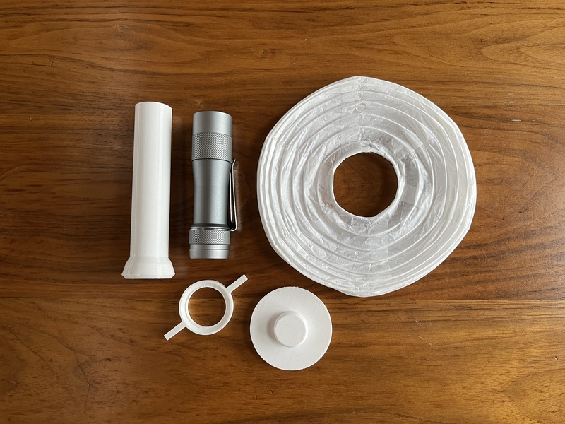

Paper lantern flashlight diffuser
=================================

This is a set of 3D printable objects which turn a flashlight and a cheap
paper lantern into a beautiful room light that is easy to travel with.

Description
-----------

Light quality (a relaxing color temperature and high color rendering) is very
important for my mood and well-being. At home, I have many small lamps with
very warm LED bulbs or with low-wattage incandescent or halogen bulbs. But,
when traveling, even the most luxurious hotel or AirBnB may have lighting
which is cold, harsh, or too bright. When it is evening, I want my residence
to be cozy and welcoming.

As a flashlight geek (this is you if you browse
[/r/flashlight](https://www.reddit.com/r/flashlight) or
[BLF](https://budgetlightforum.com/)), I usually travel with a
[Lumintop FW3A](https://lumintop.com/product/fw3a/) with LED emitters that are
very warm (2700K) and have a high color rendering index (95 CRI).

This set of 3D printable objects is a flashlight diffuser that snaps on to a
flashlight and mates it with a
[cheap (USD $1) paper lantern](https://www.amazon.com/gp/product/B0CWXCNL94)
which can collapse flat for packing, creating a portable room lighting
solution that is as high quality as whatever flashlight you already own.

The diffuser friction-fits on the flashlight, has a hat on top to prop the top
of the lantern open, and has a spacer collar on the bottom which hooks onto
the wire hoops that most paper lanterns have.

All the parts other than the diffuser tube are flat for easy packing. I put
them all into a one-quart zipper bag (I lock out the flashlight and separately
clip it to an exterior pocket of my carry-on personal item):

With this setup, I can turn off any harsh room lighting in the hotel or AirBnB
and enjoy beautiful warm light that I brought with me.

### Parts

Aside from the printed parts, you need a 6" round paper lantern and a
flashlight. You can purchase the lantern from Amazon (for example, the
[LIHAO 6 Inch White Round Paper Lantern](https://www.amazon.com/gp/product/B0CWXCNL94)
is around USD $9 for a 10-pack, search for
["6 inch paper lantern"](https://www.amazon.com/s?k=6+inch+paper+lantern)),
or for under USD $1 each from
[PaperLanternStore](https://www.paperlanternstore.com/collections/6-round-paper-lanterns/products/6-white-round-paper-lantern-even-ribbing).
If you prefer to support a local retailer, you may be able to find this at a
craft or party supply store. If you are not using the LIHAO paper lantern,
you may need to adjust the `top_diameter` parameter in the OpenSCAD to fit
the top aperture of the paper lantern.

The flashlight the 3D model is designed for is the
[Lumintop FW3A](https://lumintop.com/product/fw3a/), which has a 25.5mm outer
diameter cylindrical head. Any flashlight with enough cylindrical space at
the head (an inexpensive Convoy S2+ for example) would also work. If you
are using a different light, or your printer tolerances are different, you
may need to adjust the `light_diameter` parameter in the OpenSCAD source
(I had to print with this set to 25.8mm).

The included G-Code is for a Prusament brand PETG with the Original Prusa MINI
printer, with a 0.15mm layer height; unless you have this exact configuration,
you will want to reslice from the STL file. All the parts print cleanly with
no supports, although your slicer may recommend a brim for the spacer collar.
My printer lives in a room that is not perfectly dry, so I get some stringing
with PETG, and printing the diffuser tube by itself seems to yield better
results than printing all parts separately.

### Assembly

First print and collect the parts (you can discard any metal hanging frame
that comes with the paper lantern):

Snap together, in order, the spacer collar ring, with the notches facing
downwards; the diffuser tube; and the hat:

Most paper lanterns have metal hoops at the bottom (larger) aperture. Insert
the diffuser and hat into the bottom aperture, push the top of the hat into
the upper (smaller) aperture, and then hook the metal hoops into the spacer
collar notches.

To disassemble, it is usually easiest to unhook the metal hoops first, so you
can move the delicate lantern out of the way.

### Related

There are some very nice commercially available rechargeable lanterns, even
ones with paper shades, such as these
[TOCHIN](https://www.instagram.com/torchin__/) (sometimes spelled "TORCHIN")
lanterns sold in Japan:

This is a great product, with a beautiful wooden base, but it is very
expensive (over USD $200), doesn't collapse for packing, and is quite
fragile—the paper diffuser is fixed in place and not user replaceable.

There is an awesome open-source 3D printable
[Diffuser Lamp and Base for Emisar Lights](https://www.printables.com/model/836266-diffuser-lamp-and-base-for-emisar-lights)
made by [@Spicy3d](https://spicy3dprints.com/) which I have traveled with
before):

I love this lampshade (it's so cute!), and have carried it on road trips where
I didn't have to worry about luggage space; but it is tricky to pack (takes up
a lot of room, and can be a bit fragile unless you can print it in ABS).

This project is also listed on [Printables](https://www.printables.com):
[Paper lantern flashlight diffuser on Printables](https://www.printables.com/model/1074651-paper-lantern-flashlight-diffuser)

Author
------

Andrew Ho (<andrew@zeuscat.com>)

License
-------

Copyright© 2024 Andrew Ho.
Licensed under
[CC BY 4.0](https://creativecommons.org/licenses/by/4.0/).
